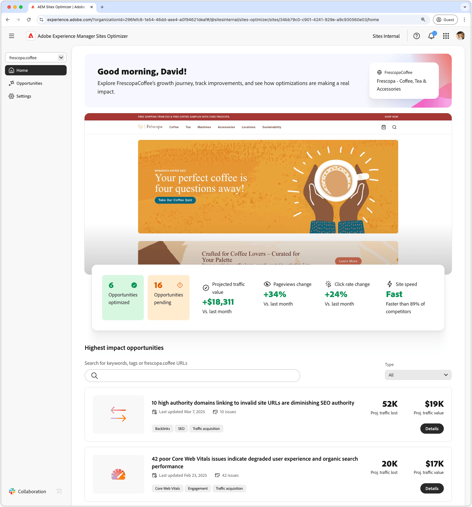

# Overview of REST and SOAP Web Services
Web services facilitate communication between distributed systems over the internet. The two primary approaches are REST (Representational State Transfer) and SOAP (Simple Object Access Protocol). Each has distinct characteristics and is suited for different use cases.

